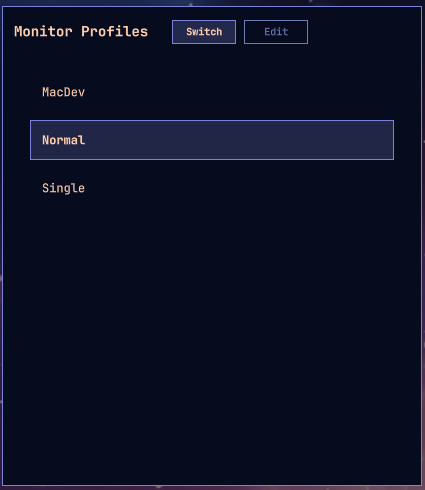
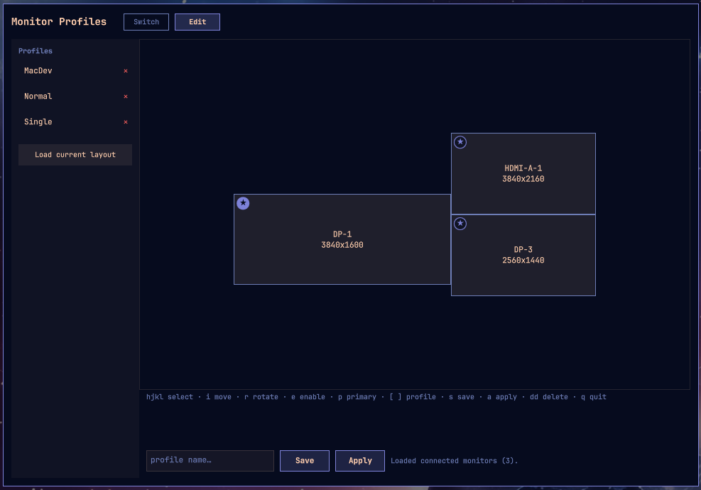

# Monitor Profiles

An [Omarchy shell plugin](https://omarchyplugins.com/develop.html) for saving
named Hyprland monitor layouts ("profiles") and switching between them —
e.g. going from three monitors down to just the laptop panel and back.

| Switch | Edit |
|---|---|
|  |  |

## Quick start

```sh
omarchy plugin add https://github.com/steveandkureen/omarchy-monitor-profiles.git --enable
```

Open it via the Omarchy menu — search "monitors" (see "Getting to it
without a mouse" below for a keybind too, if you want one).

The first time it opens, if nothing has told Hyprland to actually load the
layouts this plugin writes, you'll see a setup banner instead of the
switcher/editor. Click **Add it for me** on "Apply monitor layouts" —
that's the one step that lets the plugin actually control your monitors.
The banner's other item (an Omarchy menu entry) is only about finding the
plugin again later, not required for it to work. Do that once and you're
done: search "monitors" any time after to switch profiles or open the
editor.

## Requirements

- Omarchy quattro or later — specifically, a Lua-based Hyprland config
  (`~/.config/hypr/hyprland.lua`, requiring `hypr.monitors` etc.). Earlier
  Omarchy releases used a plain-text `hyprland.conf`/`monitors.conf`, which
  this plugin doesn't target.
- No other dependencies beyond what a working Omarchy install already has:
  `bash`, `hyprctl`, and standard coreutils (`grep`, `sed`, `ls`, `mkdir`,
  `rm`), all invoked locally — no network access, no additional packages,
  no privilege escalation.

## What it does

One panel, two modes:

- **Switch** — a compact, keyboard-driven list of saved profiles. Up/Down
  (or j/k) to move the selection, Enter to apply it. An optional auto-advance
  timer applies the current selection if left idle (default 10 seconds) —
  pass `{"timeout": 0}` to disable it.
- **Edit** — a drag-and-drop canvas: monitors are drawn to scale and
  positioned proportionally to their real layout. Drag a tile to reposition
  it, click one to edit its resolution/refresh/scale/rotation/enabled state,
  then Save as a named profile or Apply immediately. One monitor is always
  "primary" (pin badge, the (0,0) anchor everything else is stored relative
  to); dragging it pans the canvas instead of moving it, so a layout with
  more monitors than fit comfortably on screen can still be recentered
  without disturbing the actual arrangement. Click another tile's pin to
  make it primary instead.

Applying a profile writes `~/.config/hypr/hypr_screen.lua` as `hl.monitor(...)`
calls (the format Hyprland's Lua config actually understands — see
"Applying a profile", below) and runs `hyprctl reload`.

## Keyboard-only editing

Everything in the editor works without a mouse, in three vim-style modes
(a hint row under the canvas always shows the current one's bindings):

**Normal** (default)

| Key | Action |
|---|---|
| `h` `j` `k` `l` / arrows | select the nearest tile in that direction |
| `i` | enter Move mode on the selected tile |
| `e` | toggle enabled/disabled |
| `r` | rotate 90° |
| `Shift+R` | save as a new name (enter Naming mode, current name pre-filled) |
| `p` | make the selected tile primary |
| `[` / `]` | previous/next saved profile |
| `n` | load connected monitors (including ones currently disabled) |
| `s` | save (immediate if named, else enters Naming mode) |
| `a` | apply now |
| `dd` | delete the current profile |
| `Tab` | switch between Switch/Edit panel modes |
| `q` / `Esc` | close the panel (works from either mode) |

**Move** (`i` from Normal) — `h`/`j`/`k`/`l`/arrows nudge the selected tile
(or pan the canvas, if it's the primary — same distinction as dragging it
with the mouse); hold Shift for a finer step. `Esc` returns to Normal.

**Naming** (`s` with no name yet, or `Shift+R`) — type to edit the name;
`Enter` saves, `Esc` cancels.

## Install

```sh
omarchy plugin add https://github.com/steveandkureen/omarchy-monitor-profiles.git --enable
```

Or for local development, symlink this checkout into place and let Omarchy
discover it:

```sh
ln -s "$(pwd)" ~/.config/omarchy/plugins/dev.shantzware.monitor-profiles
omarchy-shell shell rescanPlugins
omarchy plugin enable dev.shantzware.monitor-profiles
```

## Getting to it without a mouse

There's no bar icon (this plugin declares `kind: "panel"`, the same as
Omarchy's own first-party `wifiqr`/`speedtest`/`disk-speedtest`), so it
needs one of these:

- **Omarchy menu** — the idiomatic path for this class of plugin; none of
  those three first-party ones use a dedicated keybind either. Search
  "monitors" in the Omarchy menu, or run `omarchy menu summon
  monitor-profiles` directly. Registered as a row in
  `~/.config/omarchy/extensions/omarchy-menu.jsonc`:
  ```jsonc
  "trigger.monitor-profiles": {"icon":"󰍹","label":"Monitor Profiles","aliases":["monitor-profiles","monitors"],"description":"Switch to a saved monitor layout","action":"omarchy-shell shell summon dev.shantzware.monitor-profiles '{\"mode\":\"switcher\"}'"}
  ```
- **A direct keybind**, if you'd rather have one — faster once you've
  picked a key, but not suggested by the plugin itself: picking one risks
  colliding with an existing default the way this exact combo collided
  with one of Omarchy's own. Add to `~/.config/hypr/bindings.lua` by hand:
  ```lua
  hl.unbind("SUPER + SHIFT + P")
  o.bind("SUPER + SHIFT + P", "Monitor Profiles switcher",
    "omarchy-shell shell summon dev.shantzware.monitor-profiles '{\"mode\":\"switcher\"}'")
  ```
  (Or bind a second key to `{"mode":"editor"}` — that's also the default
  when no mode is given.)

Omarchy has no manifest-level way for a plugin to declare or register a
menu entry either, so it's suggested rather than automatic: the setup
banner below offers to add it for you the first time it's missing
(detected by looking for this plugin's id in the extensions file, not by
which label you end up with — change it freely afterward).

The first time you open it, if `hyprland.lua` doesn't yet load what this
plugin writes (see "Applying a profile" below), and/or there's no Omarchy
menu entry yet, it shows a setup banner instead of the switcher/editor
with one checklist item per thing that's outstanding — Save and Apply
still work regardless (they're just file writes), but nothing reaches the
screen until hyprland.lua is wired up; the menu entry is just suggested,
not required. Each item's own "Add it for me" button does it for you;
"Skip for now" dismisses the whole banner for the rest of the session so
it won't re-nag on every keypress before you get to it.

## Profile storage

Profiles live in `~/.config/hypr/profiles/*.conf`, one `monitor = ...` line
per monitor. This is just the plugin's own storage format; Hyprland never
reads these files directly.

The first time the panel opens with no profiles saved anywhere yet, it
saves your live layout as one called `current` — so the switcher isn't
empty and there's a known-good fallback to revert to while you set up the
rest. This only happens once; delete `current` and it stays deleted unless
every other profile is gone too.

## Applying a profile

Omarchy quattro moved Hyprland's own config from `hyprland.conf`/
`monitors.conf` to a Lua config chain (`hyprland.lua` → `monitors.lua`,
using `hl.monitor({...})` calls). For a profile to actually take effect,
`hyprland.lua` needs to load what this plugin writes:

```lua
-- after require("hypr.monitors")
pcall(require, "hypr.hypr_screen")
```

(`pcall` so a fresh install — before any profile has been applied and the
file doesn't exist yet — doesn't break config parsing.)

## Uninstall

```sh
omarchy plugin remove dev.shantzware.monitor-profiles
```

This unloads the plugin and removes it from `~/.config/omarchy/plugins/`
(or, for a symlinked dev checkout, just unlinks it — your clone is
untouched either way). It does **not** remove, and you may want to clean up
by hand:

- The `pcall(require, "hypr.hypr_screen")` line in `~/.config/hypr/hyprland.lua`
  (harmless to leave — the `pcall` no-ops once the file it requires is gone
  — but it's dead weight).
- `~/.config/hypr/hypr_screen.lua`, the last-applied layout.
- `~/.config/hypr/profiles/*.conf`, your saved profiles.
- Your own keybind in `~/.config/hypr/bindings.lua`, if you added one.

## Development

```sh
omarchy plugin validate .                                  # manifest schema
qmllint -I "$OMARCHY_PATH/shell" *.qml                      # syntax
node test/model-security.test.js                            # profile-name/Lua-injection safety
omarchy-shell shell summon dev.shantzware.monitor-profiles '{"mode":"editor"}'
omarchy-shell shell hide dev.shantzware.monitor-profiles
```

Editing a file under `~/.config/omarchy/plugins/<id>/` usually hot-reloads;
if changes don't seem to take (stale QML component cache), force a clean
reload with `omarchy-restart-shell`.

## Files

- `manifest.json` — plugin manifest (`kind: panel`, standalone/keybind-summoned)
- `Panel.qml` — entry point: layer-shell overlay, mode switch, dismiss
- `SwitcherView.qml` — the quick-switch list
- `EditorView.qml` — the visual editor (sidebar + canvas + inspector)
- `MonitorRect.qml`, `InspectorField.qml`, `ActionButton.qml`, `ModeTab.qml` — small shared components
- `SetupBanner.qml` — first-run "hyprland.lua isn't wired up yet" prompt
- `Model.js` — profile parsing/serialization, Lua translation, live-monitor mapping
- `test/model-security.test.js` — adversarial tests for profile-name path traversal and Lua-injection escaping (`node test/model-security.test.js`)

## License

MIT
